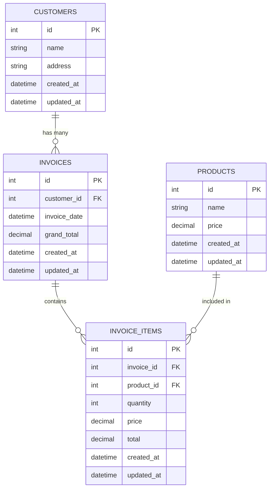

# Invoice Processor

An Excel invoice data processing library built with PHP 8.0+ that follows SOLID principles and PSR coding guidelines.

## Features

- Import invoice data from Excel files
- Store data in a SQLite3 database (extensible to other database systems)
- Command-line interface for data import
- Web interface to view data in JSON/XML format
- No third-party dependencies except for Excel handling

## Entity Relationship Diagram (ERD)



## Database Schema

### customers

| Column     | Type     | Constraints                |
| ---------- | -------- | -------------------------- |
| id         | INTEGER  | PRIMARY KEY, AUTOINCREMENT |
| name       | TEXT     | NOT NULL                   |
| address    | TEXT     | NOT NULL                   |
| created_at | DATETIME | DEFAULT CURRENT_TIMESTAMP  |
| updated_at | DATETIME | DEFAULT CURRENT_TIMESTAMP  |

### products

| Column     | Type          | Constraints                |
| ---------- | ------------- | -------------------------- |
| id         | INTEGER       | PRIMARY KEY, AUTOINCREMENT |
| name       | TEXT          | NOT NULL                   |
| price      | DECIMAL(10,2) | NOT NULL                   |
| created_at | DATETIME      | DEFAULT CURRENT_TIMESTAMP  |
| updated_at | DATETIME      | DEFAULT CURRENT_TIMESTAMP  |

### invoices

| Column       | Type          | Constraints                |
| ------------ | ------------- | -------------------------- |
| id           | INTEGER       | PRIMARY KEY, AUTOINCREMENT |
| customer_id  | INTEGER       | NOT NULL, FOREIGN KEY      |
| invoice_date | DATETIME      | NOT NULL                   |
| grand_total  | DECIMAL(10,2) | NOT NULL                   |
| created_at   | DATETIME      | DEFAULT CURRENT_TIMESTAMP  |
| updated_at   | DATETIME      | DEFAULT CURRENT_TIMESTAMP  |

### invoice_items

| Column     | Type          | Constraints                |
| ---------- | ------------- | -------------------------- |
| id         | INTEGER       | PRIMARY KEY, AUTOINCREMENT |
| invoice_id | INTEGER       | NOT NULL, FOREIGN KEY      |
| product_id | INTEGER       | NOT NULL, FOREIGN KEY      |
| quantity   | INTEGER       | NOT NULL                   |
| price      | DECIMAL(10,2) | NOT NULL                   |
| total      | DECIMAL(10,2) | NOT NULL                   |
| created_at | DATETIME      | DEFAULT CURRENT_TIMESTAMP  |
| updated_at | DATETIME      | DEFAULT CURRENT_TIMESTAMP  |

## Relationships

1. A customer can have multiple invoices (one-to-many)
2. An invoice belongs to one customer (many-to-one)
3. An invoice can have multiple invoice items (one-to-many)
4. A product can be included in multiple invoice items (one-to-many)
5. An invoice item belongs to one invoice (many-to-one)
6. An invoice item refers to one product (many-to-one)

## Project Structure

```
invoice-processor/
├── bin/
│   └── console.php            # Command line entry point
├── public/
│   └── index.php              # Web line entry point
├── src/
│   │   ├── Entity/            # Entity classes
│   │   ├── Repository/        # Repository interfaces and implementations
│   │   └── Services/          # services class
|   |   └── Commands/          # CLI commands
│   ├── Infrastructure/        # Infrastructure layer
│   │   ├── Database/          # Database connections
│   │   ├── Excel/             # Excel readers
│   │   └── Web/               # Web output handlers
├── tests/                     # Test suite
│   ├── Unit/                  # Unit tests
│   └── bootstrap.php          # Test bootstrap
├── var/                       # Variable data (database, logs, etc.)
├── vendor/                    # Composer dependencies
├── composer.json              # Composer configuration
├── phpunit.xml                # PHPUnit configuration
└── README.md                  # This file
```

## Design Patterns Used

- **Repository Pattern**: To abstract data access layer from the domain logic
- **Strategy Pattern**: For different Excel reader implementations
- **Dependency Injection**: For loose coupling between components
- **Command Pattern**: For CLI implementation

## Architecture

This project follows a layered architecture design:

1. **Domain Layer**: Contains the business logic and entities (Entity,Repository,Services)
2. **Infrastructure Layer**: Contains implementations for external services like database and file handling (Database,Excel,Web)
3. **Application Layer**: Orchestrates the use cases and user interactions (Services, CLI Commands)

## Installation

1. Clone the repository:

   ```bash
   https://github.com/Ahmed-AESoliman/invoice-processor.git
   cd invoice-processor
   ```

2. Install dependencies:

   ```bash
   composer install
   ```

3. Create the database directory:
   ```bash
   mkdir -p var
   ```

## Usage

### Command Line

Import data from an Excel file:

```bash
php bin/console.php import path/to/your/excel_file.xlsx
```

### Web Interface

Start the PHP development server:

```bash
composer dev
```

or

```bash
php -S localhost:8000 -t web/
```

Then visit [http://localhost:8000](http://localhost:8000) in your browser to view the data in JSON format.

## Testing

Run the test suite:

```bash
composer test
```

Or directly:

```bash
./vendor/bin/phpunit
```

## Extensibility

### Adding Support for Different Database Systems

1. Create a new implementation of the `Connection` interface
2. For example, to add MySQL support:
   ```php
   // src/Infrastructure/Database/MysqlConnection.php
   class MysqlConnection implements Connection {
       // Implement the required methods
   }
   ```

### Adding Support for Different Excel Reader Libraries

1. Create a new implementation of the `ExcelReaderInterface`
2. For example, to add Spout support:
   ```php
   // src/Infrastructure/Excel/SpoutExcelReader.php
   class SpoutExcelReader implements ExcelReaderInterface {
       // Implement the required methods
   }
   ```
